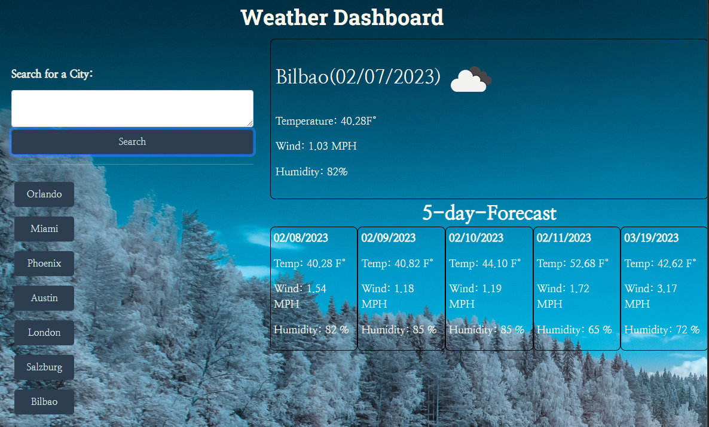

# Weather Forecast

## Description

In this challenge I learned how to call an API to load the weather information in my webpage. I also learned how to set up and use an API key and followed the required URL syntax to get different kinds of API results. I used one URL to get the current weather, and another to get the forecast for the next 5 days.

My motivation was to feel comfortable calling API's and displaying the needed information in my webpage. I also wanted to keep practicing my javascript and css skills.

## Usage

Weather Forecast

Enter a city in the input area and click the search button. In the right side of the screen the current weather and the forecast for the next 5 days will appear.
In the bottom left of the screen, buttons with the names of the searched cities will be displayed, and once clicked they will show again the information for the  city that was clicked.

Link to the deployed app https://ginitadavis.github.io/Weather-Forecast/

## License
MIT License

Copyright (c) [2022] [Gina Davis]

Permission is hereby granted, free of charge, to any person obtaining a copy of this software and associated documentation files (the "Software"), to deal in the Software without restriction, including without limitation the rights to use, copy, modify, merge, publish, distribute, sublicense, and/or sell copies of the Software, and to permit persons to whom the Software is furnished to do so, subject to the following conditions:

The above copyright notice and this permission notice shall be included in all copies or substantial portions of the Software.

THE SOFTWARE IS PROVIDED "AS IS", WITHOUT WARRANTY OF ANY KIND, EXPRESS OR IMPLIED, INCLUDING BUT NOT LIMITED TO THE WARRANTIES OF MERCHANTABILITY, FITNESS FOR A PARTICULAR PURPOSE AND NONINFRINGEMENT. IN NO EVENT SHALL THE AUTHORS OR COPYRIGHT HOLDERS BE LIABLE FOR ANY CLAIM, DAMAGES OR OTHER LIABILITY, WHETHER IN AN ACTION OF CONTRACT, TORT OR OTHERWISE, ARISING FROM, OUT OF OR IN CONNECTION WITH THE SOFTWARE OR THE USE OR OTHER DEALINGS IN THE SOFTWARE.
